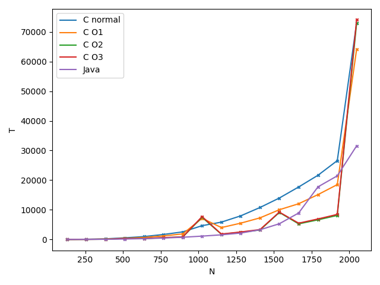
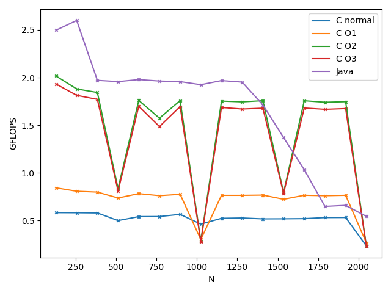
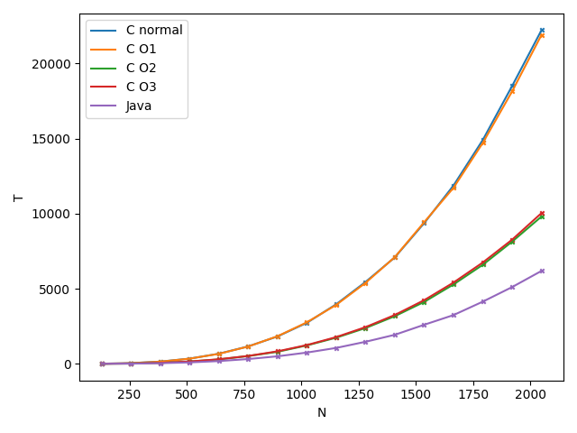
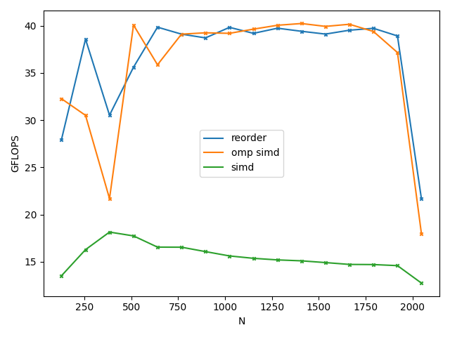
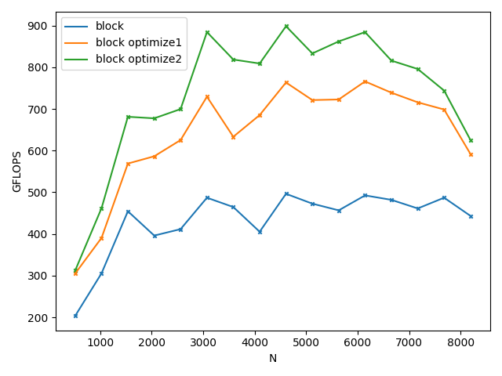

<center><h1>Project2:Matrix Multiplication</h1></center>

**Name**: 周益贤(Zhou Yixian)

**SID**: 12211825

## Part1 项目分析

项目要求分别用 C 语言和 Java 分别实现矩阵乘法，比较效率并进行分析。

朴素的矩阵乘法复杂度为 $O(n^3)$, 虽然现在已有复杂度更优的算法，如 $O(n^{2.81})$ 的 Strassen 算法，但是由于各方面限制，朴素的矩阵乘法反而在大部分情况效率更优。因此本次项目将分别使用 Java 和 C 语言，尝试实现更快的朴素矩阵乘法，并分析限制矩阵乘法效率的因素具体是什么。

测试主要分为两方面：

1. 分别用两种语言实现相同的优化手段，比较它们执行相同算法的运行效率。
2. 使用两种语言所允许的任何优化手段，比较它们能提供的最佳效率。

测试中 Java 不使用第三方矩阵乘法库，因为它们可能就是用 C 或 C++ 实现的。

为了便于测试，此次比较的矩阵均为方阵，且大小均为 $64$ 的整数倍。

#### 1. 测试平台

+ 处理器：AMD R9-3900X

     下列数据来自 CPU-Z.

     + 基础频率：3.8 GHz， 最大频率：4.6 GHz，经观察测试时频率通常在 4.2 GHz 左右。
     + 核心数：12，线程数：24.
     + 缓存：L1D: 384KB, L2: 6MB, L3: 64MB.

+ 内存：32GB 3200 MHz (1600MHz x2) 

     + 通道：2x64 bits

+ 操作系统：Windows10 22H2

#### 2. 分析指标 

为了更好地分析矩阵乘法的性能，除了统计用时，这里额外采用两个指标：

1. 时间对数

   根据复杂度理论，当矩阵大小 $n$ 足够大时，低阶项可忽略，计算用时近似正比与 $n^3$，即
   $$
   \begin{align}
   T &= k n^3\\
   \log T &= \log k + 3\log n 
   \end{align}
   $$
   可以发现 $\log T$ 正比于 $\log n$，直线拟合后可以更清楚地看出效率差异，即直线越靠近图表右下方，代表效率越高。

   ~~同时也避免一些样例用时过长画不下~~

2. 每秒浮点运算次数 $\text{FLOPS}$

   $\text{FLOPS}$ 是常用的衡量计算速度的指标。

   朴素的矩阵乘法采用公式：$C_{i,j} = \sum\limits_{k=1}^n A_{i,k}\cdot B_{k,j}$，需要 $n^3$ 次乘法和 $n^3$ 次加法，即实际进行了 $2n^3$ 次浮点运算。

   故计算速度 $v = \dfrac {2\cdot 10^{-6}n^3 } {T}$ ，其中 $T$ 单位为毫秒，$v$ 单位为十亿次浮点运算每秒，即 $\text{ GFLOPS}$.

#### 3. 机器性能估计

该项目中的实测数据来源于 AIDA64 benchmark.

通过比较理论性能与实际表现，可以估计运算瓶颈。

1. CPU 性能：

   该 CPU 共有 $12$ 核心，支持 avx2 指令集，不支持 avx512 指令集，频率按 $4.2$ GHz 计算。

   矩阵乘法中可用 fma 指令，同时对 $8$ 个单精度浮点数完成一次乘法和一个加法，花费 0.5 个时钟周期。

   故该 CPU 的理论性能为：
   $$
   v = 12\times 4.2 \times 8 \times 2 / 0.5 = 1612.8 \text{ GFLOPS}
   $$
   实测 CPU 的单精度浮点性能为 $1578$ GFLOPS.

   如果没有使用并行，则只使用一个核心：
   $$
   v = 4.2 \times 8 \times 2 / 0.5 = 134.4 \text{ GFLOPS}
   $$
   如果不使用 SIMD，则每个周期仅进行一次浮点运算：
   $$
   v = 12\times 4.2 = 50.4 \text{ GFLOPS}
   $$
   若均不使用，则运算效率约等于频率，$v = 4.2 \text{ GFLOPS}$

   由于 CPU 的频率不固定，实际性能可能有波动，但不会有太大偏差。

2. 内存性能：

   内存频率为 $3200$ MHz，通道为2x64bits，内存带宽为 $3.2\times 2\times 64/8 = 51.2 \text{GBps}$，即每秒最多传输 $12.8\text{G}$ 个单精度浮点数。

   实测内存读取速率为 $47.7$ GBps，写入速率为 $45.9$ GBps. 相当于 $11.5-12\text{G}$ 个单精度浮点数。

   L1 - L3 缓存的速率均接近甚至超过 $1$ TBps，不太可能构成瓶颈，不作讨论。

测试均为极其理想的情况（CPU总有运算任务，内存始终在不间断地访问），然而实际运算过程中 CPU 和内存会相互制约，结果可能远差于二者理论性能。

## Part2 测试准备

#### 1. 矩阵定义

C 语言的矩阵定义如下：

```c
typedef float value_type;

typedef struct _matrix{
    value_type* data;
    size_t rows;
    size_t cols;
}mat_t[1], *mat_ptr;
```

使用一维数组模拟二维数组，位于 $(i,j)$ 的元素实际位置为 `data[i * cols + j]`

Java 的矩阵定义如下：

```java
class Matrix{
    float[][] data;

    Matrix(int n, int m){
        data = new float[n][m];
    }
    
    int getRow(){
        return data.length;
    }

    int getCol(){
        return data[0].length;
    }
    //some member functions
}
```

#### 2. 计时方法

由于一些小矩阵的乘法用时可能小于 1ms，`clock`无法有效计时，这里采用更精确的时间：

```c
double get_clock(){
    struct timespec tim;
    clock_gettime(CLOCK_MONOTONIC, &tim);
    return tim.tv_sec * 1e3 + tim.tv_nsec / 1e6;
}
```

Java 使用 `System.nanoTime()` 获得纳秒级时间间隔。

~~实测这两个东西其实末几位从来没变过，不是真的纳秒级，不过微秒级也够用了~~

#### 3. 测试方法

由 C++ 的 mt19937 生成随机矩阵，使用仅并行加速的双精度朴素乘法计算结果作为标准答案，生成 $2^6=64$ 至 $2^{13} = 8196$ 共 $8$ 组矩阵及答案。每个矩阵乘法需要先测试这些用例，答案最大误差小于 $0.001$ 视为正确。通过正确性测试的矩阵根据用时划分为快组和慢组进行速度测试。

速度测试使用 C / Java 的随机函数生成矩阵，不检验结果是否正确，部分 C 语言项目分别使用 无优化/O1/O2/O3 四种编译选项进行测试。 

快组测试 $[512,8196]$ 范围内的方阵，步长 $512$，共计 $15$ 组矩阵。

慢组测试 $[128,2048]$ 范围内的方阵，步长 $128$，共计 $15$ 组矩阵。

每组测试重复 $4$ 次，舍弃第一次，以平均用时作为结果。

（主要是为 Java 考虑，Java 在 JVM 刚启动时的第一组测试慢的吓人）

## Part3 测试结果及分析

编译选项：

```
gcc -Wall -Wextra -fopenmp -mavx -mavx2 -mfma (-O1|-O2|-O3)
```

#### 1. 普通乘法

普通乘法按照公式，使用三重循环直接计算：

C 语言：

```c
for(int i = 0; i < N; i++)
    for(int j = 0; j < K; j++)
        for(int k = 0; k < M; k++)
            res(i, j) += a(i, k) * b(k, j);
            //由于一维数组模拟，直接写出一维下标比较丑陋
            //为了易于理解，这里使用(i,j)表示元素坐标，
            //不代表实际代码实现，下文同。
```

Java：

```java
for (int i = 0; i < N; i++) 
    for (int j = 0; j < K; j++) 
        for (int k = 0; k < M; k++) 
            res.data[i][j] += data[i][k] * mat.data[k][j];
```

用时：



对数拟合：


算力：



无优化的 C 慢的可怜，仅有 $0.6 \text{ GFLOPS}$ 左右。

使用 O1 优化选项后，速度略有提升，但仍然不足 $1\text{ GFLOPS}$，可以看出 O1 可以做的优化比较有限。

在加入了 O2/O3 优化后事情才有起色，达到了 $1.7 \text{ GFLOPS}$ 左右，但仍然不及 Java.

Java 的速度出人意料地快，在 1024 以下的矩阵乘法中甚至要快过O3的 C 语言， 但是在矩阵大小超过 1024 后效率有显著下降，从而被 O2/O3 反超。

Java 不是半编译半执行语言吗，怎么如此迅速，难道 JVM 有什么魔法，比 CPU 还快？

好吧，其实已经被 Java2 剧透了答案了。答案是 JIT ( Just-In-Time)，即时编译优化。它可以检测热点代码，及时将它们编译成汇编，以提高运行效率。

可是 C 不是编译型语言吗？怎么还慢于即时编译的 Java 了？

可能是 Java 使用了一些 SIMD 吧，这确实比较奇怪，毕竟 JIT 都能认出来的优化，GCC 为何会认不出来呢？

同时也可以注意到几个比较有意思的问题：

1. O3 比 O2 优化更激进，但是反而变慢了。说明编译器并不能保证所有的优化都是正面的。

2. C 语言在 O2 及以上优化水平下，在矩阵大小恰为 $512$ 的整数倍时，效率有断崖式的下跌。这种下跌在 $1024$、$2048$ 处尤为明显（事实上 O1 也有轻微的趋势）。这也是 $\ln T-\ln N$ 图中几个远离直线的点的由来。

   这种现象非常诡异，可以在不同机器上稳定复现。虽然原因不明，但是我们可以在下一部分中看出一些端倪。

不管怎么说，我们目前 CPU 理论算力只有可怜的 $4.2\text{ GFLOPS}$，而它甚至还没跑满，说明内存方面还有些问题。

#### 2. 转置乘法

注意到一句话：

```c
for(int k = 0; k < M; k++)
    res(i, j) += a(i, k) * b(k, j);
```

这里 b 每次访问一个新的元素，都跳到下一列，即跳过一整行的元素，这可能会浪费一些性能。

因为每次从内存中加载新元素都会把它周围的一些元素一同载入到缓存中，叫做缓存行（Cache Line），而跳过一行的行为无疑浪费了这些缓存，所以我们试图先将 B 矩阵转置，再进行乘法：

```C
for(int k = 0; k < M; k++)
    res(i, j) += a(i, k) * b_trans(j, k)
```

这时候可以发现，内层循环的三次寻址都是连续的，我们可以更好地利用上缓存行的性能。

虽然我们需要额外做一次转置，但它依然可能有正面效果，毕竟转置是比较快的。

用时：



对数拟合：


算力：


好吧，C 语言方面看起来只有一点提升，而 Java 则提升到了接近 $3\text{ GFLOPS}$.

不过也有一点好消息：无论是 C 还是 Java，恼人的断崖下跌都没有了，这也给我们一点暗示：之前奇怪的逢 512 骤降可能是寻址问题导致的。可惜具体是什么地方的问题已经很难考证了，毕竟汇编里也没有线索，要想弄明白可能还得再看更底层的东西。

说实话 Java 这么快我是没想到的，这种优化对 JVM 的效果竟然高过 C，更是出乎意料。

然而我们离理论算力还有很远的距离（指 C 不到 $2\text{ GFLOPS}$

#### 3. 交换循环顺序

还是上一回中的问题，不过我们换一种解决思路：

对于这样一个三重循环

```c
for(int i = 0; i < N; i++)
    for(int j = 0; j < K; j++)
        for(int k = 0; k < M; k++)
            res(i, j) += a(i, k) * b(k, j);
```

我们还有一种优化方式：交换 `k, j` 的枚举顺序。

```c
for(int i = 0; i < N; i++)
    for(int k = 0; k < M; k++)
    	for(int j = 0; j < K; j++)
            res(i, j) += a(i, k) * b(k, j);
```

同时这样做还有一个优越性：`a(i, k)` 不再与内层循环 `j` 相关，可以用一个变量临时保存。这不仅省去了寻址的开销，还有更可能将其保存在寄存器中，实现更高效的运算。

在高优化等级下，编译器很有希望看出这一点。

算力：


用时：


O3 优化后算力直接达到了 $40\text{GFLOPS}$， Java 也达到了 $25\text{GFLOPS}$ ，这又是怎么回事？

看来 `a(i, k)` 不再与内层循环相关这一点的意义，远不止存入寄存器这么简单。

查阅资料发现：O3 除了采用 O2 的优化手段外，还会额外进行 **向量化** 优化，也就是 SIMD 优化。

SIMD (**Single Instruction Multiple Data**)，即单指令流多数据流，允许一条指令处理多条数据。

比如这一句：

```c
for(int j = 0; j < K; j++)
    res(i, j) += a(i, k) * b(k, j);
```

编译器终于认出了它们是可以优化的，经过 O3 编译后，产生了如下指令（节选了运算符 += 的部分）

```assembly
vmovups (%rdi,%r11), %ymm0
vfmadd213ps     (%rcx,%r11), %ymm1, %ymm0
vmovups %ymm0, (%rcx,%r11)
```

注意到这几条指令都有后缀 `ps`，它表示 "packed single"，即矢量单精度相加。

ymm系列寄存器大小为 $256$ 位，即一次运算八个 `float` 的乘加运算，CPI 为 0.5，理论可以提升 $32$ 倍的性能。

当然，这需要开启 `-mavx2 -mfma` 的编译指令，否则 GCC 只会使用 SSE 指令集对 $4$ 个 `float` 进行打包。

而 O2 产生的汇编为（同样节选 += 的部分）

```assembly
vmovss  (%rax), %xmm1
vmovss  0(%r13), %xmm0
addq    $4, %rax
addq    $4, %rdx
vfmadd132ss     -4(%rdx), %xmm1, %xmm0
vmovss  %xmm0, -4(%rax)
```

结尾为 `ss` ，即单个单精度运算，没有向量化的提升，理论只能提升 $4$ 倍性能。

O3 对比 O2 实际提升约 $7.2$ 倍，O2 对比 O1 提升约 $3.9$ 倍，基本符合预期。

既然 C 能用 SIMD，Java 自然也能用。不过 Java 需要 JIT 在运行中意识到这一点，这又需要一些时间，加上虚拟机的开销，终究是落后于 C 了。

~~C 怎么现在才打赢~~

不过相比于之前算出来的单核理论性能 $134.4 \text{ GFLOPS}$，这二者都变成了垃圾，问题又在哪？

#### 4. SIMD

难道是编译器写的 SIMD 不够好？

让我们手写一份试试：

```c
for(int i = 0; i < N; i++)
    for(int j = 0; j < K; j++){
        __m256 sum = _mm256_setzero_ps();
        value_type *a_ptr = &a->data[i * M];
        value_type *bt_ptr = &bt->data[j * M];
        for(int k = 0; k < M; k += 8)
            sum = _mm256_fmadd_ps(_mm256_loadu_ps(a_ptr + k), _mm256_loadu_ps(bt_ptr + k), sum);
        value_type tmp = 0;
        for(int i = 0; i < 8; ++i)
            tmp += sum[i];
        res->data[i * K + j] = tmp;
    }
```

事实上 openmp 提供了 `#pragma omp simd` 指令，可以无需改动代码就实现 SIMD 调用：

```c
value_type v = a->data[i * M + k];
#pragma omp simd
for(int j = 0; j < K; j++)
    res(i, j) += v * b(k, j);
```

Java 则没有显式调用 SIMD 的能力，故不作测试。



手写的 SIMD 效率奇低，而 openmp 的优化基本等同于 O3.

看来有的东西确实没必要自己动手，毕竟调函数还是不如编译器自己写指令来得直接。

使用 openmp 显示调用 SIMD 和 O3 自动优化效果差不多，观察汇编发现确实没什么区别。

看来瓶颈不在 SIMD ，那又是什么问题呢？

可以注意到，无论是哪种方式实现的 SIMD，在 $2048$ 大小的矩阵下都有一个显著的降低。

不妨继续增大矩阵，看看会发生什么。


在越过 $2048$ 后，情况急转直下，最终稳定在 $13\text{ GFLOPS}$.

$2048$ 是什么？大小为 $2048$ 的矩阵占用内存 $16$ MB，三个矩阵共占 $48$ MB，很有可能就是在这个节点三缓终于容不下它们了，从而使得算力逐渐接近内存带宽。

用上了 SIMD 后，我们的 CPU 算力有着大幅的提升，但是内存带宽却依然停留在 $12.5 \text{G}$ 个 float 每秒，而一次矩阵乘法中需要 $3N^3$ 次内存读写，显然最终的算力已经被内存限制住了。

所以我们要考虑一下如何减少内存读写次数了，否则面对大矩阵我们始终束手无策。

#### 5. 分块

被经常访问的数据会被放入缓存，如果我们每次都集中计算一小块数据，会不会好一些呢？

假设我们将矩阵分成 $L\times L$ 的小块，每个小块都小到足以被放入 L2 甚至 L1 缓存当中，这样我们只需要在刚开始从内存中加载这个小块，之后就可以从缓存中读取了，内存访问次数就下降到了 $O(N^2)$ 级别。

```c
float A[BS][BS];
float B[BS][BS];
float C[BS][BS];

for(int bi = 0; bi < N; bi +=BS){
    for(int bk = 0; bk < M; bk += BS){
        //copy block to A
        //...

        for(int bj = 0; bj < K; bj += BS){
            //reset C and copy block to B
            //...
            for(int i = 0; i < BS; ++i)
                for(int k = 0; k < BS; ++k){
                    value_type v = A[i][k];
                    #pragma omp simd
                    for(int j = 0; j < BS; ++j)
                        C[i][j] += v * B[k][j];
                }
			//store C to res
        }
    }
}
```

看起来复杂了很多，这样真的不会负优化吗...


幸运的是结果和预期相符。可以看到我们的算力不仅又有所增长，还不再随矩阵增大而降低了，这是一个很好的消息。

不过这个优化对 Java 不仅没有任何效果，甚至比最普通的乘法还慢，应该是打乱了 Java 原本的优化逻辑，并且在 Java 中的小矩阵不一定能如愿保存到缓存中，导致这个优化并不生效。

#### 6. 并行化

（不同优化级别的区别已经比较明显了，所以接下来 C 仅测试 O3）

这颗 CPU 有 12 颗核心，可是我们却只用上了一颗。

这好吗？这不好。

OpenMP 允许我们相当轻松地并行化代码，几乎不需要对代码进行任何改动：

```c
// #pragma omp parallel for
for(int i = 0; i < N; i++){
	//do sth.
}
```

Java 中则可以使用 `ExecutorService` ，将要执行的逻辑打包成 `Runnable` 对象，也能比较容易地完成并行。

```java
ExecutorService executor = Executors.newFixedThreadPool(24);
ArrayList<Future<?>> futures = new ArrayList<>();

for (int i = 0; i < N; i++) {
    var C = res.data[i];
    var A = data[i];
    var ftr = executor.submit(()->{
        // do sth.
    });
    futures.add(ftr);
}
```

~~C 语言的并行竟然比 Java 还清爽，我怎么会做这样的梦~~


对比不使用 SIMD 的情况，C 的算力从略高于 $5 \text{ GFLOPS}$ 如愿提升到了 $62\text{ GFLOPS}$，基本提升了 $12$ 倍，符合预期。

而使用 SIMD 的情况，C 的算力从 $12-40\text{ GFLOPS}$ 提升到了 $100-240\text{ GFLOPS}$ ，提升幅度则要略小一点，不过依然足够显著。

而 Java 对比一般情况的 $3 \text{ GFLOPS}$ 提升到了 $35 \text{ GFLOPS}$，亦有 $12$ 倍的提升。

然而对比之前重排序的情况，它事实上还慢了，可能是并行化后没能用上 SIMD。

~~对Java的优化总有种开盲盒的感觉~~

当然，即使用了并行 + SIMD，C 依然不可避免地掉速度了。

所以加上分块优化再试一试（块长为 $64$，下同）


算力随着矩阵增大不降反升，最终稳定在 $300 \text{ GFLOPS}$，效果显著。

#### 7. 内存对齐

之前提到过，Cache Line 机制会把附近的元素一起载入内存，在本机 Cache Line 长度为 $64$ B，因此我们将分块的小矩阵按 64 字节对齐，期待每次被载入 Cache Line 的都是同一行的元素：

```c
#include<stdalign.h>
alignas(64) float A[BS][BS];
alignas(64) float B[BS][BS];
alignas(64) float C[BS][BS];
```

Java 不能使用内存对齐，分块对其也没有优化，故跳过此项测试。

结果：


简单的对齐竟然将算力提升到了 $500 \text{ GFLOPS}$ ，实在是出人意料。

不过使用 `aligned_malloc` 却没有带来什么性能提升，可能是因为访问主要集中在分块数组而非原数组中。

#### 8.小块优化

接下来考虑对小块之间的乘法进行优化：

```c
value_type v = A[i][k];
#pragma omp simd
for(int j = 0; j < BS; ++j){
	C[i][j] += v * B[k][j];
}
```

根据之前的观察，这段代码需要先加载 C 数组的内容到 `ymm` 寄存器中，然后做一次乘加运算，再存放回去，这不是很高效。

考虑用一个临时变量一次性累加四列的内容，再存放进 C 数组，就可以减少少量的内存读写，同时也能减少循环跳转次数。

```c
for(int i = 0; i < BS; ++i)
    for(int k = 0; k < BS; k += 4){
        value_type v1 = A[i][k];
        value_type v2 = A[i][k + 1];
        value_type v3 = A[i][k + 2];
        value_type v4 = A[i][k + 3];
        #pragma omp simd
        for(int j = 0; j < BS; ++j){
            value_type t = 0;
            t += v1 * B[k][j];
            t += v2 * B[k + 1][j];
            t += v3 * B[k + 2][j];
            t += v4 * B[k + 3][j];
            C[i][j] += t;
        }
    }
```


提升幅度有点超出预期。

不过美中不足的是内层循环中的四个式子都与中间变量 `t` 相关，数据不独立，可能影响效率。

现在最内层已经被 SIMD 自动展开了， 中间层则被我们手动展开，那么外层能不能也展开一下呢？

不妨试一试。

```c
for(int i = 0; i < BS; i += 2)
    for(int k = 0; k < BS; k += 4){
        value_type v01 = A[i][k], v02 = A[i][k + 1],
        		   v03 = A[i][k + 2], v04 = A[i][k + 3];
        value_type v11 = A[i + 1][k], v12 = A[i + 1][k + 1],
        		   v13 = A[i + 1][k + 2], v14 = A[i + 1][k + 3];
        #pragma omp simd
        for(int j = 0; j < BS; ++j){
            value_type t1 = 0 , t2 = 0;

            t1 += v01 * B[k][j];
            t2 += v11 * B[k][j];

            t1 += v02 * B[k + 1][j];
            t2 += v12 * B[k + 1][j];

            t1 += v03 * B[k + 2][j];
            t2 += v13 * B[k + 2][j];

            t1 += v04 * B[k + 3][j];
            t2 += v14 * B[k + 3][j];

            C[i][j] += t1;
            C[i + 1][j] += t2;
        }
    }
```

最外层的展开会导致内部代码呈现平方级别的膨胀，所以步长仅设置为 $2$.

`t1` 和 `t2` 是两组不相关的数据，我们期待这里的数据独立性能对 CPU 的流水线有所帮助。



确实带来了微弱的提升，我们的算力已经接近 $900\text{ GFLOPS}$了，对比理论算力 $1576\text{ GFLOPS}$ 差的不算很大了。

#### 9. OpenBlas

可能还有很多可做的优化，但是难度已经太大了，我不希望最终代码里充斥着几十上百行的展开和复杂的 SIMD 调用甚至内联汇编。

所幸有人帮我们做了：开源库 OpenBLAS 为我们实现了极致高效的矩阵乘法，所以不妨看看我们离 C 语言的极限还差多远。

~~其实严格来说 OpenBLAS 的 kernel 已经更接近汇编而不是 C 了~~


好吧，看起来我们的效率只有 OpenBLAS 的 $75\%$，并且随着矩阵增大越差越多。

OpenBLAS 的算力最终维持在 $1200\text{ GFLOPS}$，达到了理论算力的 $76\%$，考虑到浮点运算之外的开销，已经相当接近理论值了。

不过这已经出乎我的意料了，毕竟短短几行代码，能做到 OpenBLAS 的四分之三，我已经很满意了。

#### 10. 总结与补充

**C 与 Java**

我们是不是从哪一步开始已经把 Java 忘掉了？

Java 在并行化之后就再难以做出什么有效的优化了，面对大矩阵 $10\text{ GFLOPS}$ 的算力甚至画不进图里。

~~毕竟坐标轴那条线都有 200 的算力~~

要展示 Java 的效率，我们不得不把数据范围缩小一点：


很显然，从结果来看，不算OpenBLAS， 我们自己写的 C 最快也达到了 $800-900\text{ GFLOPS}$，并且面对相当大的矩阵都能维持这个效率，比 Java 的 $10-30\text{GFLOPS}$ 快了不知道多少倍。

但 C 的领先并非理所当然。如果我们什么都不做，或者只做一些基础的优化，那么 Java 反而要领先 C 很多。Java 真正落后是发生在我们开始做缓存优化时，因为缺乏底层的优化手段导致后续优化都无法进行。

也就是说，C 语言只是允许我们做很多事情，我们可以提示编译器（甚至亲自）使用指令集，可以重排内存布局优化缓存问题，甚至可以微调循环结构来优化流水线效率，然而如果我们什么都不做，就不能指望它依然遥遥领先于其他语言。

而 Java 也并非很慢，并非不可优化。只是由于隔了一层 JVM，我们不能直观地像 C 语言一样预期编译器的行为，所以可以优化的手段要更少，更表面。

**编译器优化级别**

说完了 C 与 Java 的效率差异，我们再来总结一下 O1 O2 O3 之间的区别。

不开启任何优化时，产生的汇编和源代码几乎一一对应，可以保证调试符合预期。

+ O1 旨在减小实际代码大小，同时进行一些不太耗时的优化，如下面这段代码

```c
int test(){
    int a = 1;
    int b = a * 2;
    return b;
}
```

O1 后产生汇编

```assembly
test:
    movl    $1, %eax
    ret
```

可以看到 `a, b` 的相关代码全部被省略，直接返回了 $2$，而不开启 O1 则会逐步生成汇编。

+ O2 将启用几乎所有的优化选项，如优化内存访问等：

```c
int test(int a[8]){
    return sum(a);//sum 为一个简单求和函数
}
```

O1 后产生汇编

```assembly
test:
    call    sum
    ret
```

直接调用了 sum 函数。

O2 后产生汇编

```assembly
test:
    movdqu  16(%rdi), %xmm1
    movdqu  (%rdi), %xmm0
    paddd   %xmm1, %xmm0
    ...
```

可以看到不仅内联了 sum 函数，还使用了 SSE2 指令集优化。

+ O3 在 O2 的基础上会额外采用更加激进的向量化优化以及其他优化，提高代码并行度，这点文中的矩阵优化就是现成的例子。

所以编译器也只是在按部就班地尝试优化，并不能保证开启 O3 就一定会有一份很快的代码，真正的速度还是取决于写代码的人。

**即时编译** 

说到 Java 快的时候，我们总是提到即时编译器 JIT，它的作用到底有多大？

由于没有 JIT 的 Java 实在慢的没法用，这部分测试没有放进正文，故在此补充。

运行时加入选项 `-Xint` 即可禁用 JIT:


可以观察到，没有 JIT 的代码确实如我们预想中一样缓慢，即使开启了并行都没有正常跑的朴素乘法快，不开并行甚至只有可怜的 $0.1\text{ GFLOPS}$.

正是由于 JIT 的存在，Java 在执行简单任务时甚至能收获不输于 C 的效率。

## Part 4. 疑难与解决

1. 后期测试由于矩阵较大，部分不优秀的算法一轮测试通常要跑近半个小时，笔记本容易发热降频

   解决办法：换台式机。

2. 测试结果不稳定，有小范围波动

   这个跟电脑状态有关，确实没办法，即使取了三轮平均依然会有这个问题（事实上取再多轮也没用，因为电脑性能就是在波动）

   解决办法是尽可能关闭后台程序，并保证同一张图内的数据是在相近的时间内测得的，至少能保证对比有意义。

3. 未解之谜：为什么朴素乘法逢 $512$ 的倍数会掉速度

   虽然知道直接原因是什么，但是依然反推不出原理。

   首先明确：

   + 不是在附近速度下降，而是精确地仅在这一个点下降。

     

   + 不是机子的问题，可在不同电脑复现。

   通过 VTune 可以分析出，导致速度下降的原因是爆了 L2 缓存。

   1024:

   

   1023:

   

   可以看到矩阵大小为 $1024\times 1024$ 时，L3 bound 显著增大。

   但是如果真是爆缓存的问题，没道理在 $1025$ 处又能恢复，所以我到最后也没有想明白到底是什么原理。

## Part 5. 参考列表

优化部分有参考 B 站 up 主 DepthBuffer 的视频 [BV1L841117gJ](https://www.bilibili.com/video/BV1L841117gJ) 的优化思路。

测试部分使用了第三方库 OpenBLAS 作为速度参考，为了防止缺少库导致无法通过编译，上交的代码中注释了这部分代码。

代码及报告不含 AI 生成内容。